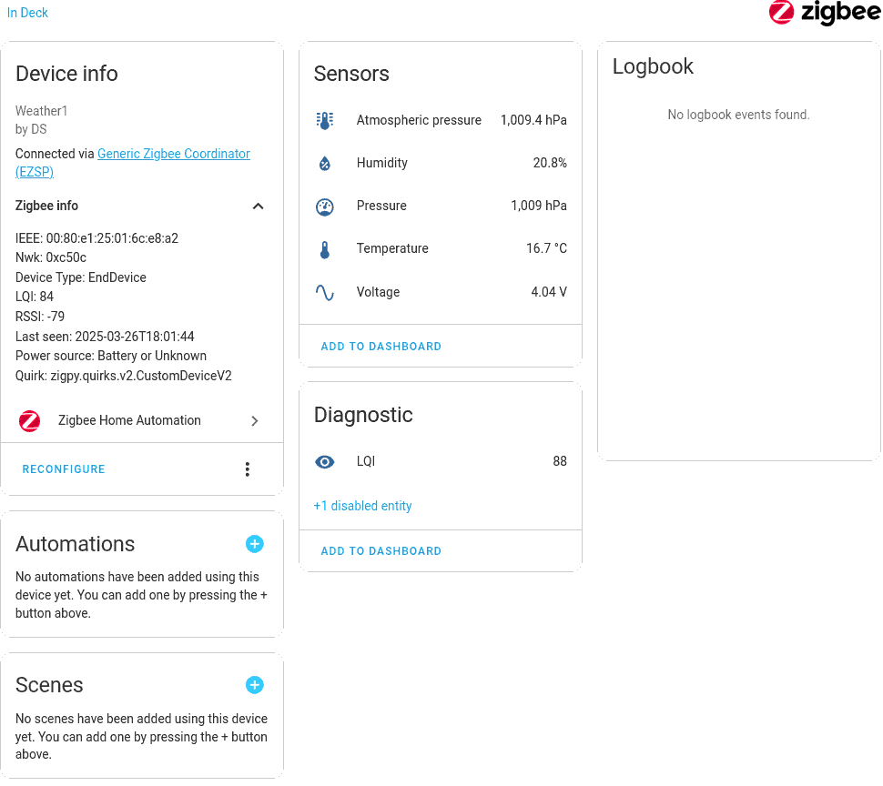
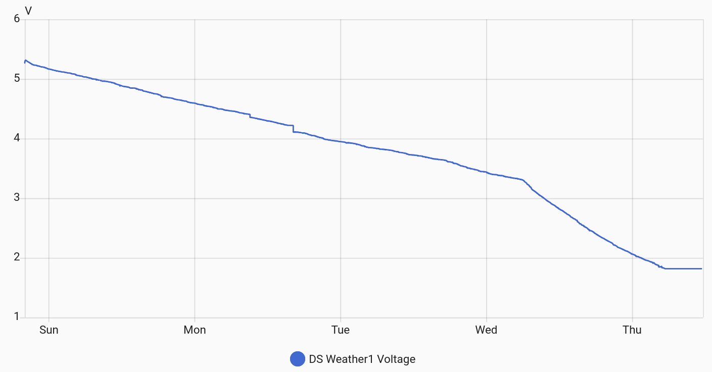

# stm32-weather-sensor
Outdoor air sensor using STM32WB55 and Home Assistant Zigbee integration

## Overview
The primary goal of this project is to experiment with low-power modes of the STM32 microcontroller by building a Zigbee Sleepy End Device (SED) that can operate off-grid using solar power.

## Hardware
This project is based on the [WeAct STM32WB55-Core board](https://github.com/WeActStudio/WeActStudio.STM32WB55CoreBoard "Github link: STM32WB55 Core Board").  
This compact board provides essential features:
- LDO regulator: ME6231A33M3G, with 3–18 V input and 500 mA output.
- HSE oscillator: 32 MHz.
- LSE crystal: 32.678 kHz.
- Reverse-voltage protection MOSFET.
- GPIO-controlled blue LED (PE4).
- PCB antenna.

For sensing, I've considered either the BME280 or BMP280 paired with an AHT20. Both sensors are readily available on Aliexpress, pre-soldered onto breakout boards. The difference between these sensors is minimal, but in my tests, the BMP280+AHT20 pair provided slightly more accurate temperature and humidity measurements, thus making it into the final design.

In addition to the sensors, I've selected a small outdoor solar-powered light with a replaceable battery, also from Aliexpress. It acts both as the power source and enclosure while still serving its primary purpose as an outdoor light. There's sufficient space inside the enclosure to house the controller board. However, the sensor itself must be placed outside the casing, as the enclosure may heat up significantly in direct sunlight.

To monitor battery charge levels, I have implemented a simple voltage divider. While straightforward to implement, its downside is a continuous, albeit minimal, background battery discharge. To mitigate this, I used two high-value resistors (1MΩ and 330KΩ), minimizing the discharge current. Testing with the ADC revealed that about 50 ms of sampling is needed to measure battery voltage accurately. For the project's purpose, this sampling time is acceptable.

## Zigbee Setup
Since this sensor is battery-powered, it must be configured as a sleepy end device. The firmware implements one endpoint and four measurement clusters:

- Temperature
- Humidity
- Pressure
- Voltage

Battery voltage is reported through AC voltage attributes, as ZHA does not currently support DC voltage measurements.

Pairing the STM32WB55 with ZHA can be somewhat challenging. STM's implementation of SED involves aggressive power-saving optimizations. Upon joining a Zigbee network, the firmware immediately switches to low-power mode with default polling intervals of 30 seconds. ZHA, however, expects the device to report its configuration, clusters, attributes, and values. Due to the default SED polling interval, ZHA often times out, resulting in an incomplete device setup in Home Assistant.

A solution that I've found effective—though not consistently—is temporarily enabling a fast-polling mode for a few minutes immediately after joining the network for the first time.

Additionally, several other ZHA-specific adjustments are configured in the ZHA quirk file. The default reporting configuration is overly conservative and infrequent. I also prefer sensor readings with greater decimal precision.

The connection information is stored in persistent storage, enabling automatic re-joining to the network upon controller restart.

The device page in Home Assistant should appear as follows:  

## Power Usage
The firmware is configured to wake up once every 20 seconds, perform sensor readings, and update the reportable attributes. The CPU spends the remainder of the time in STOP2 low-power mode. STOP2 is the deepest STOP mode and does not retain the I²C and ADC registers, requiring these peripherals to be re-initialized and shut down during each wake-up cycle.

Sensors are also powered down while the CPU is in the stopped state, thus requiring re-initialization upon wake-up.

The active phase lasts approximately 0.5 seconds and consumes about 5–15 mA for the entire system, including CPU, RF, and sensors. During the stopped phase, the CPU draws approximately 10 µA. Consequently, the average consumption is expected to be around 100–200 µA.

Without access to an integrating current meter, I resorted to a simple approach using an ultracapacitor to measure the average current consumption.

I charged a 30 F capacitor to 5.3 V and used it to power the sensor board. Voltage decay was recorded by the sensor itself, with Home Assistant capturing the data over time. After a few days, I obtained the voltage-versus-time plot shown below:  

The voltage decay rate remains constant until reaching the LDO threshold of 3.3 V. At 1.8 V, the circuit shuts down completely. From the voltage decay slope, average current consumption can be estimated using:

I = C × dV/dt

The resulting calculation indicates approximately 200 µA of total current. Given that the ultracapacitor has a documented self-discharge rate of about 100 µA, the sensor itself consumes around 100 µA.

The documented battery capacity is 1200 mAh, thus a full day's operation of the sensor would minimally impact the battery's charge.